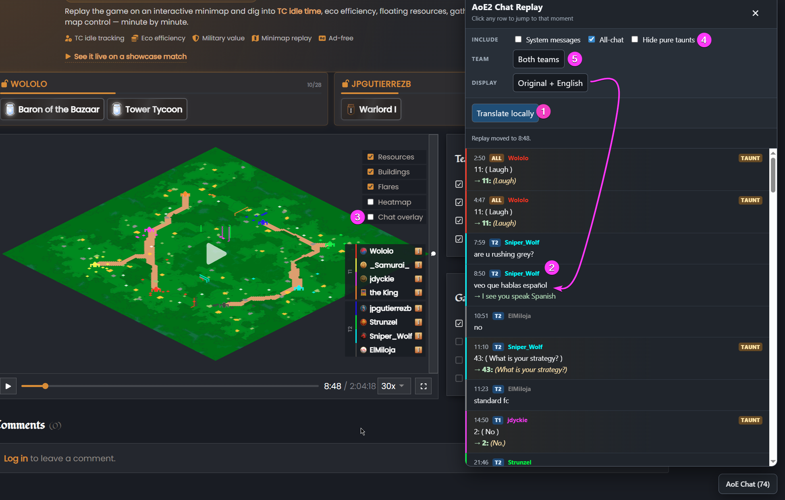

# aoe2insights-chat-replay
Unofficial userscript that adds a browsable, locally translated chat replay panel to AoE2 Insights matches.
# AoE2 Insights Chat Replay

Unofficial userscript that adds a browsable chat replay panel to analyzed AoE2 Insights matches.

It extracts the full in-game chat timeline from replay analysis data, cleans up common replay noise, and makes the conversation easier to inspect without waiting for the replay to play through in real time.

## Features

* Displays the complete in-game chat transcript as soon as replay analysis finishes
* Uses Chrome's built-in local translation tools for supported languages (Screenshot item #1)
* Optionally show original text, translation, or both (Screenshot item #2)
* Adds a toggle for the site's native floating chat overlay (Screenshot item #3)
* Optionally hides messages that only contains taunts (Screenshot item #4)
* Filters messages by team and all-chat visibility (Screenshot item #5)
* Click any chat row to jump the replay to that moment
* Shows or hides system messages
* Normalizes age-up messages into English
* Displays resignation and disconnect events
* Decodes AoE II taunts from `1` through `105`

* Flags translations that may be unreliable
* Provides an optional Google Translate fallback for individual messages
* Detects romanized Chinese / Pinyin and routes those messages to Google Translate when Chrome's local translator cannot handle them cleanly

## Privacy

The script reads the replay-analysis JSON that AoE2 Insights already loads for the match page.

It does **not** automatically upload replay data or chat messages to an external service.

On supported Chrome versions, standard translations use Chrome's built-in local translation tools. If a message needs a stronger translator, the script shows a Google Translate link for that individual message. Nothing is sent to Google unless you click that link.

## Compatibility

### Recommended

* Chrome
* ScriptCat or another compatible userscript manager

### Partial support

* Firefox with Violentmonkey can use the transcript, filtering, replay navigation, and cleanup features
* Automatic local translation is currently Chrome-only

## Installation

### Option 1: Install from Greasy Fork

https://greasyfork.org/en/scripts/581329-aoe2-insights-chat-replay-and-translator

### Option 2: Install manually from GitHub

1. Install a userscript manager such as ScriptCat for Chrome or Violentmonkey for Firefox.
2. Open [`aoe2insights-chat-replay.user.js`](./aoe2insights-chat-replay.user.js).
3. Copy the entire file.
4. Create a new userscript in your userscript manager.
5. Replace the default template with the copied script.
6. Save the script.
7. Open an AoE2 Insights match and click **Analyze** on a replay round.

After analysis finishes, an **AoE Chat** button appears in the lower-right corner.

## Usage

1. Open an AoE2 Insights match.
2. Click **Analyze** on a replay round.
3. Wait for the replay map to appear.
4. Open the injected **AoE Chat** panel (AoE Chat button appears in bottom-right)
5. Click **Translate locally** to translate supported messages with Chrome's local translation model.
6. Click any transcript row to jump the replay to that moment.

Messages that Chrome cannot translate reliably may show a warning icon or a Google Translate fallback link.

## Known limitations

* Chrome's local translator is weaker than the Google Translate website for slang, typos, insults, and very short fragments.
* Romanized Chinese / Pinyin can be detected locally, but Chrome's local Chinese translator does not currently translate it well. Those rows use an optional Google Translate fallback.
* Replay-analysis output may contain localized or malformed system messages that require additional cleanup rules.
* This is an unofficial community tool and is not affiliated with AoE2 Insights or Microsoft.

## Contributing

Bug reports and examples of mistranslated or unrecognized messages are welcome.

When reporting an issue, include:

* The original replay message
* The displayed translation
* The expected translation, if known
* The AoE2 Insights match link, if you are comfortable sharing it
* A screenshot or console error, if relevant

## License

MIT
